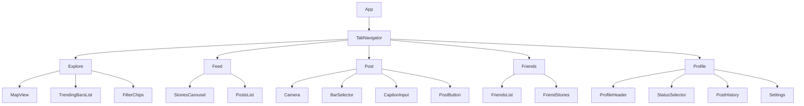

# Google Maps & Places API Setup

This app uses Google Maps and Google Places API to show real bars in your area. Follow these steps to set up the API:

## 1. Get a Google Cloud Project

1. Go to [Google Cloud Console](https://console.cloud.google.com/)
2. Create a new project or select an existing one
3. Enable billing for your project (required for API usage)

## 2. Enable Required APIs

In your Google Cloud Console, enable these APIs:
- **Places API** - For finding nearby bars
- **Maps SDK for Android** - For Android map display
- **Maps SDK for iOS** - For iOS map display

## 3. Create API Key

1. Go to **Credentials** in your Google Cloud Console
2. Click **Create Credentials** → **API Key**
3. Copy the generated API key

## 4. Configure API Key

1. Open `config/api.js` in your project
2. Replace `'YOUR_GOOGLE_PLACES_API_KEY'` with your actual API key:

```javascript
export const API_CONFIG = {
  GOOGLE_PLACES_API_KEY: 'your_actual_api_key_here',
  // ... other config
};
```

## 5. Restrict API Key (Recommended)

For security, restrict your API key:

1. In Google Cloud Console, click on your API key
2. Under **Application restrictions**, select **Android apps** and/or **iOS apps**
3. Add your app's bundle identifier:
   - Android: `com.yourcompany.nightoutapp`
   - iOS: `com.yourcompany.nightoutapp`
4. Under **API restrictions**, select **Restrict key**
5. Select only the APIs you need:
   - Places API
   - Maps SDK for Android
   - Maps SDK for iOS

## 6. Test the App

1. Run the app: `npm start`
2. Allow location permissions when prompted
3. The app will show real bars in your area (or mock data if API key isn't configured)

## Features

- **Real-time bar discovery** based on your location
- **Popularity ratings** using drink emojis (🍸🍸🍸🍸🍸)
- **Detailed bar information** including ratings, hours, and specials
- **Interactive map** with custom markers
- **Location-based search** within 2km radius

## Troubleshooting

- **"API key not configured"**: Make sure you've added your API key to `config/api.js`
- **"No bars found"**: Check that Places API is enabled and your API key has proper permissions
- **Map not loading**: Ensure Maps SDK is enabled for your platform
- **Location not working**: Check that location permissions are granted

## Cost

Google Places API has a free tier:
- 28,500 free requests per month
- $0.017 per additional 1,000 requests

For most users, the free tier is sufficient for testing and moderate usage. 

Absolutely! BarHop’s vision is clear, and your feature set is both ambitious and achievable. Here’s a **comprehensive plan** to get you started, covering:

1. **Component & Navigation Structure**
2. **Database Schema (Firebase/Firestore)**
3. **Code/Data Flow**
4. **Key Tech Choices & Next Steps**

---

## 1. 🧩 Component & Navigation Structure

**Bottom Tab Navigator:**
- **Explore (🔍):** Map + trending bars list, filter chips, search.
- **Feed (📈):** Stories, posts, and updates from bars/friends.
- **Post (➕):** Camera, bar selector, caption input, post button.
- **Friends (👥):** List of friends, their status, current bar, stories.
- **Profile (👤):** User info, status, post history, settings.

**Component Tree Example:**


---

## 2. 🗄️ Database Schema (Firebase/Firestore Example)

**Users**
```json
users/{userId}:
  displayName: string
  profilePic: string
  bio: string
  status: "online" | "offline" | "hidden"
  currentBarId: string
  lastActive: timestamp
  friends: [userId]
```

**Bars**
```json
bars/{barId}:
  name: string
  location: { lat: number, lng: number }
  address: string
  crowd: string
  vibe: string
  tags: [string]
  popularity: number
  trendingScore: number
  yelpId/googlePlaceId: string
```

**Posts**
```json
posts/{postId}:
  userId: string
  barId: string
  mediaUrl: string
  mediaType: "image" | "video"
  caption: string
  timestamp: timestamp
  tags: [string]
```

**Stories**
```json
stories/{storyId}:
  userId: string
  barId: string
  mediaUrl: string
  timestamp: timestamp
  expiresAt: timestamp
```

**Reviews**
```json
reviews/{reviewId}:
  userId: string
  barId: string
  tags: [string] // e.g. ["Vibe", "Live DJ"]
  timestamp: timestamp
```

---

## 3. 🔄 Code/Data Flow

### **A. Map & Bar Discovery**
- On Explore tab load:
  - Get user location (Expo Location).
  - Query Google Places/Yelp for bars nearby.
  - Merge with your own `bars` collection for extra data (popularity, trending, tags).
  - Display as map markers and in a trending list.

### **B. Posting a Story/Pic**
- User taps ➕, opens camera.
- After capture, user selects bar (from map/list), adds caption, tags.
- Upload media to storage (Firebase Storage), create post/story in Firestore.
- Update bar’s trending score.

### **C. Feed**
- Query recent posts/stories from bars near user or from friends.
- Show as Instagram/Snapchat-style stories carousel and feed.

### **D. Status & Presence**
- User can set status (online/offline/hidden).
- Store in user profile, update in real-time (Firestore presence or Realtime Database).
- Show friends’ status and current bar.

### **E. Reviews**
- Tap-based review UI (chips/buttons).
- Store as review documents, aggregate for bar tags/trending.

---

## 4. 🛠️ Key Tech Choices

- **Expo + React Native:** For fast, cross-platform mobile dev.
- **react-native-maps:** For map display.
- **Expo Camera:** For story/pic capture.
- **Firebase Auth/Firestore/Storage:** For real-time data, posts, stories, presence.
- **Google Places API / Yelp Fusion API:** For bar discovery and enrichment.
- **Cloud Functions (optional):** For trending calculations, notifications, etc.

---

## 5. 🚀 Next Steps

### **A. Scaffold the Navigation & Core Screens**
- Set up bottom tab navigation with all 5 tabs.
- Create placeholder components for each tab.

### **B. Implement Map & Bar Discovery**
- Integrate `react-native-maps` and location.
- Fetch bars from Google Places/Yelp.
- Show markers, trending list, and filter chips.

### **C. Set Up Firebase**
- Auth, Firestore, Storage.
- User profile, posts, stories, reviews collections.

### **D. Build Posting Flow**
- Camera, bar selector, caption, upload.

### **E. Build Feed & Friends**
- Stories carousel, posts list, friends list/status.

---

## 6. 🏗️ Example Directory Structure

```
/src
  /components
    MapView.js
    TrendingBarsList.js
    StoriesCarousel.js
    PostCard.js
    BarSelector.js
    StatusSelector.js
    ...
  /screens
    ExploreScreen.js
    FeedScreen.js
    PostScreen.js
    FriendsScreen.js
    ProfileScreen.js
  /navigation
    TabNavigator.js
    StackNavigator.js
  /firebase
    config.js
    api.js
  /utils
    barApi.js
    presence.js
    ...
```

---

## 7. 📝 Let’s Start!

**Would you like to:**
- Begin with the navigation and screen scaffolding?
- Dive into the map/bar discovery component?
- Set up Firebase and the database schema?
- Or something else first?

**Attach your UI mockups and I’ll tailor the component structure and code to match your vision!** 

---

## **How to Add Your Google Places API Key to Your App**

### 1. **Create or Update the API Config File**

Let’s store your API key in a config file.  
**File:** `NightOutApp/config/api.js`

**Add this code:**
```js
// NightOutApp/config/api.js
export const GOOGLE_PLACES_API_KEY = 'qZTNZJFniGZ1bTAP38IgJkVxNvQ=';
```

---

### 2. **Update MapScreen to Use the API Key**

- In your `MapScreen.js`, import the key:
  ```js
  import { GOOGLE_PLACES_API_KEY } from '../config/api';
  ```
- Use this key when making requests to the Google Places API.

---

### 3. **(Optional) Restrict Your API Key**
- In the Google Cloud Console, go to **APIs & Services > Credentials**.
- Click the pencil icon next to your key.
- Under **API restrictions**, select:
  - Places API
  - Maps SDK for Android
  - Maps SDK for iOS
- Under **Application restrictions**, restrict by platform if possible.

---

### 4. **Next: Wire Up the Google Places API in MapScreen**

I’ll add the code to fetch real bars from Google Places using your key, and display them as markers.

**Proceeding to:**
- Create/update `config/api.js` with your key.
- Update `MapScreen.js` to fetch and display real bars.

Let’s do 

---

## Camera Issue Checklist

Your code and import look correct. If you are still getting "Cannot read property 'Type' of undefined", here are the most likely causes:

### 1. **expo-camera is not installed or not linked**
- You must run:  
  ```
  npx expo install expo-camera
  ```
- If you already did this, try deleting your `node_modules` and `package-lock.json`, then run:
  ```
  rm -rf node_modules package-lock.json
  npm install
  npx expo start -c
  ```

### 2. **Multiple versions or cache issues**
- If you have both `react-native-camera` and `expo-camera` installed, this can cause conflicts.  
  Only use `expo-camera` for Expo projects.

### 3. **Incorrect import or shadowing**
- Double-check you do **not** have a line like:
  ```js
  import Camera from 'react-native-camera';
  ```
- Only this is correct:
  ```js
  import { Camera } from 'expo-camera';
  ```

### 4. **Expo Go is out of date**
- Make sure your Expo Go app is up to date from the App Store/Play Store.

### 5. **Expo managed workflow**
- If you ejected to bare workflow, you need to run `npx pod-install` in the `ios` directory and rebuild the app.

---

## Next Steps

### 1. **Check expo-camera Installation**
Please run this and paste the output:
```sh
npm list expo-camera
```
or
```sh
yarn list expo-camera
```

### 2. **Check for Multiple Camera Packages**
Please run:
```sh
npm list react-native-camera
```
If you see `react-native-camera` in your dependencies, uninstall it:
```sh
npm uninstall react-native-camera
```

### 3. **Restart Everything**
- Stop your dev server.
- Close Expo Go on your phone.
- Run:
  ```
  npx expo start -c
  ```
- Reopen the app.

---

## If Still Broken

If you still get the error, please let me know:
- The output of `npm list expo-camera`
- The output of `npm list react-native-camera`
- Your Expo SDK version (from `package.json`)

---

### **About the API REQUEST_DENIED**

This is a separate issue with your Google Places API key.  
Once the camera is working, I can help you fix the API key problem.

---

**Let me know the results of the above checks, or if you want me to add a defensive check in your code to avoid the crash!** 

---

**Here’s what’s happening:**
- The error `Cannot read property 'Type' of undefined` means `Camera` is `undefined`.
- This happens if:
  1. `expo-camera` is not installed or not linked.
  2. You are running in a web environment (Expo Go web does not support Camera).
  3. There is a typo or conflict in your import.
  4. You are using an outdated Expo Go app.

---

## Step-by-Step Fix

### 1. **Check Your Import**
Your code should have:
```js
import { Camera } from 'expo-camera';
```
**Do not use:**  
`import Camera from 'expo-camera';`  
or  
`import { Camera } from 'react-native-camera';`

---

### 2. **Check expo-camera Installation**
In your project root, run:
```sh
npx expo install expo-camera
```
This ensures the correct version for your Expo SDK.

---

### 3. **Check for Multiple Camera Packages**
Run:
```sh
npm list react-native-camera
```
If you see it, run:
```sh
npm uninstall react-native-camera
```
You should only use `expo-camera` with Expo.

---

### 4. **Clear Cache and Restart**
Run:
```sh
npx expo start -c
```
- Close Expo Go on your phone completely (swipe it away).
- Reopen Expo Go and scan the QR code again.

---

### 5. **Check Your Environment**
- **Expo Go on iOS/Android**: Camera works.
- **Expo Go on Web**: Camera does NOT work and will throw this error.

---

### 6. **Update Expo Go**
Make sure your Expo Go app is up to date from the App Store/Play Store.

---

## If You Still Get the Error

Please run and share the output of:
```sh
npm list expo-camera
```
and
```sh
npm list react-native-camera
```
and let me know your Expo SDK version (from `NightOutApp/package.json`).

---

**Summary:**  
- This is not a code bug, but a runtime/dependency/environment issue.
- Follow the above steps and it will be fixed!

Let me know if you want me to add a defensive check in your code to avoid the crash, but the real fix is in your environment. 

Thank you for confirming you are running on a real iPhone with the latest Expo Go and have the correct `expo-camera` installed.  
This means you should **not** be seeing `Cannot read property 'Type' of undefined` unless something is very unusual.

Let's do a final, thorough check and try a minimal test:

---

## 1. **Double-Check Your Import and Usage**

At the very top of your `PostScreen.js`, you should have:
```js
import { Camera } from 'expo-camera';
```
**NOT** `import Camera from 'expo-camera';`  
**NOT** `import { Camera } from 'react-native-camera';`

---

## 2. **Minimal Camera Test**

Let's try a minimal camera screen to rule out any other issues.  
Replace your `PostScreen.js` with this code temporarily:

```js
import React, { useState, useRef, useEffect } from 'react';
import { View, Text, TouchableOpacity, StyleSheet } from 'react-native';
import { Camera } from 'expo-camera';

export default function PostScreen() {
  const [hasPermission, setHasPermission] = useState(null);
  const cameraRef = useRef(null);

  useEffect(() => {
    (async () => {
      const { status } = await Camera.requestCameraPermissionsAsync();
      setHasPermission(status === 'granted');
    })();
  }, []);

  if (hasPermission === null) {
    return <View style={styles.center}><Text>Requesting camera permission...</Text></View>;
  }
  if (hasPermission === false) {
    return <View style={styles.center}><Text>No access to camera</Text></View>;
  }

  return (
    <View style={{ flex: 1 }}>
      <Camera
        style={{ flex: 1 }}
        ref={cameraRef}
        type={Camera.Constants.Type.back}
      />
    </View>
  );
}

const styles = StyleSheet.create({
  center: { flex: 1, alignItems: 'center', justifyContent: 'center' }
});
```

**Then:**
- Save the file.
- Run `npx expo start -c` again.
- Open the app on your iPhone.

---

## 3. **If This Works**
- The issue is with something else in your original file (possibly a shadowed variable or a typo).
- You can then reintroduce your features one by one.

## 4. **If This Still Fails**
- There may be a deeper issue with your Expo Go install or your project setup.
- Try creating a brand new Expo project and add only `expo-camera` and the above code to see if it works.

---

## 5. **Share Your Expo SDK Version**
Please copy the line from your `NightOutApp/package.json` that looks like:
```json
"expo":
``` 